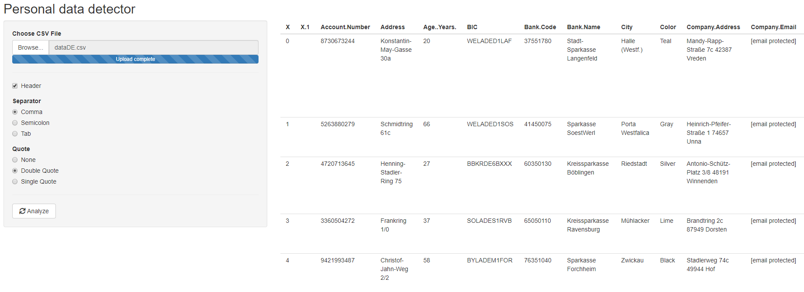

Personal Data Detector
================

# Abstract

The files included in this repository and described below build the
prototype for an interactive tool in R shiny, which can detect various
types of personal data, typical for the German market, in structured
text files.  
<https://alex-m-ffm.shinyapps.io/Prototype/>  

-----

## Dictionaries.R

This script builds a collection of regular expressions for a range of
data and combines those with dictionaries of common first and last names
in Germany and all names of German municipalities.  
These regular expressions and dictionaries are then save in an Rdata
file, that is later used in the script detecting the data.

Sources used for dictionaries:  
\- **first names**:  
\- Names of newborns from [Open Data portal of the city of
Düsseldorf](https://opendata.duesseldorf.de/dataset/vornamen)  
\- Wiktionary lists of most common first names in the public phone book
in 2005
[Men](https://de.wiktionary.org/wiki/Verzeichnis:Deutsch/Namen/die_h%C3%A4ufigsten_m%C3%A4nnlichen_Vornamen_Deutschlands)
[Women](https://de.wiktionary.org/wiki/Verzeichnis:Deutsch/Namen/die_h%C3%A4ufigsten_weiblichen_Vornamen_Deutschlands)  
\- **last names**:  
\- [Digital dictionary of surnames in Germany
\(DFD\)](http://www.namenforschung.net/dfd/woerterbuch/gesamtliste-veroeffentlichter-namenartikel/)  
\- **names of municipalities**:  
\- [Federal Statistical
Office](https://www.destatis.de/DE/Themen/Laender-Regionen/Regionales/Gemeindeverzeichnis/Administrativ/Archiv/GV100ADJ/GV100AD31122017.html)

The data from Wiktionary and the DFD were web-scraped using the *rvest*
package.

## topic\_models.R

This script first retrieves a range of text documents needed for topic
modeling. First, text paragraphs are scraped from Wikipedia using the
*rvest* package on topics in the area of sexual orientation, political
opinion and health. Then, for the field of sexual orientation, also two
works by Sigmund Freud are retrieved from Project Gutenberg, using the
*gutenbergr* package.

After tokenizing the documents to their individual words with the *tm*
package, they are cleaned from common German stopwords (those contained
in the *stopwords* package and some additional ones manually added),
punctuation and numbers. Then, we build the document-term matrix which
is then fed into a topic model with three topics, using Latent Dirichlet
Allocation (LDA). The below figure visualizing the \(\gamma\)
probabilities of the documents belonging to each topic shows that the
model is able to separate the topics quite well.  

Using the *tidytext* package, we then build tidy dataframe containing
the \(\beta\) probabilities to belong to each topic for each word, so
that these can later be used in the detection algorithm. Further we save
a chosen quantile of the distributions to have some threshold value that
needs to be surpassed in order to not have too many false positives.

## Detect\_as\_function.R

The detection algorithm works in two steps:  
1\. For all columns it is computed what the ratio of non-empty cells
matching the regular expressions or dictionaries is. Sequentially, the
columns are assigned to the best matching data type until there are no
more remaining columns above a certain threshold.  
2\. For the remaining columns it is then checked whether the cells
contain text and if yes, the text is matched with the \(\beta\)
probabilities from the topic model. Mean probabilities for each column
for each topic are then computed and the column is assigned to the best
matching topic, provided the \(\beta\) is high enough.

## app\_0\_2.R

This shiny app provides a very simple web-based user interface to load
text files and analyze them with a single button with the previously
described function.

## Generate\_synthetic.R

This script can generate multiple synthetic datasets in bulk using the
Base R *sample()* command.  
It will always create information on names, addresses and dates using
different formats with a certain probability. Other columns are
sometimes generated with some probability. All columns will contain some
degree of empty cells. Strings used for columns on the sensitive topics
health, political opinion and sexual orientation are based on the
respective top terms from the estimated topic model in terms of
\(\beta\) probabilities. For street names, a list compiled from
OpenStreetmap was retrieved from
[Datendieter.de](https://www.datendieter.de/item/Liste_von_deutschen_Strassennamen_.csv).
For license plates, the list of city identifiers was retrieved from
[www.kfz-auskunft.de](https://www.kfz-auskunft.de/autokennzeichen/download.php/?file=kennzeichen.csv).
For the column mixing names of individuals and companies, the list of
companies was scraped from Wikipedia, based on [global
turnover](https://de.wikipedia.org/wiki/Liste_der_gr%C3%B6%C3%9Ften_Unternehmen_in_Deutschland_\(weltweite_Ums%C3%A4tze\))
and [value
added](https://de.wikipedia.org/wiki/Liste_der_gr%C3%B6%C3%9Ften_Unternehmen_in_Deutschland_\(Wertsch%C3%B6pfung\)).

## evaluate.R

This script loops through the previously generated data sets, runs the
detection algorithm and stores the results in a combined dataframe (and
.csv-file), also creating dummy variables for successful matches.
